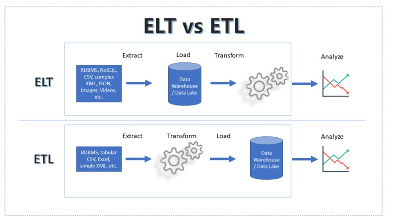
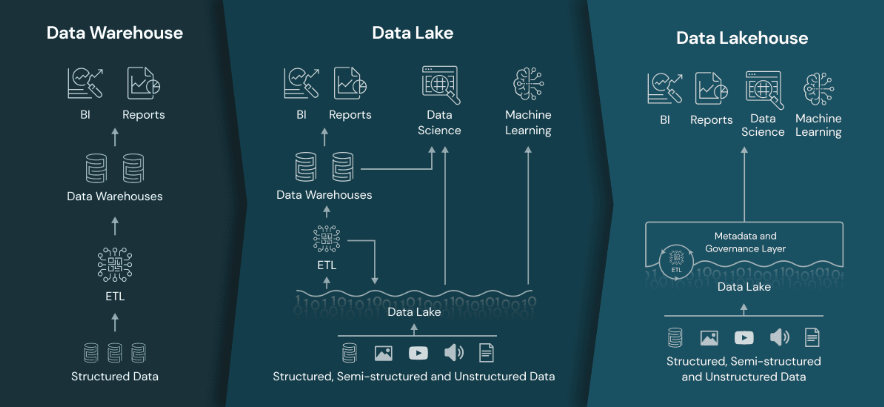
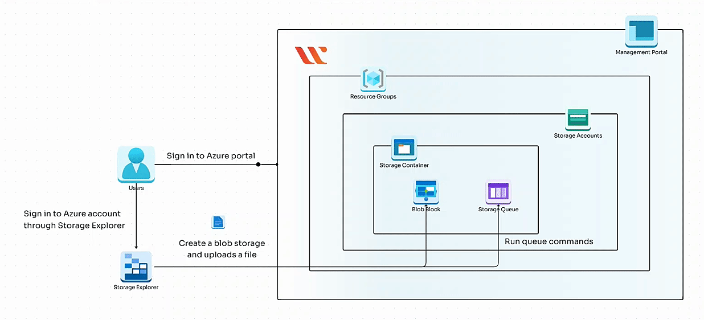

<h1>Azure Data Engineering</h1>

This repository contains all my hands-on exercises, notes, code, notebooks, and outputs as I learn and practice Azure Data Engineering for 30 days.

## 🗓️ Day-wise Progress

Day | Topic | Status
--- | --- | ---
Day 1 | ETL vs ELT | ✅ Completed
Day 2 | ETL Hands-on (Google Colab) | ✅ Completed
Day 3 | Batch vs Stream Processing | ✅ Completed
Day 4 | Data Lake vs Warehouse vs Lakehouse | ✅ Completed
Day 5 | Data Lake Lab using Azurite | ✅ Completed
Day 6 | Delta Lake Fundamentals  |  Upcoming

I am documenting everything I learn each day — with code examples, Google Colab notebooks, theory notes, visuals, and output files.

## 🚀 Day 1 – ETL vs ELT Fundamentals


### Topics Covered

ETL (Extract–Transform–Load)

ELT (Extract–Load–Transform)

Differences, architecture, and use cases

Tools used in ETL vs ELT

Why ELT is preferred in modern cloud systems

### Deliverables

Theory notes

Architecture diagrams

Comparison table

📂 Folder: day-01-etl-elt/
Contains:

ETL-vs-ELT.md

Architecture diagrams

Notes

## 🚀 Day 2 – ETL Hands-On Using Google Colab

### Topics Covered

✔ Loaded CSV directly from GitHub (raw link)
✔ Performed transformations using Pandas
✔ Renamed columns
✔ Filtered rows
✔ Added new calculated fields
✔ Saved processed CSV
✔ Downloaded output

Code Used
import pandas as pd

url = "https://raw.githubusercontent.com/mwaskom/seaborn-data/master/tips.csv"
df = pd.read_csv(url)

**1. Rename column**

df = df.rename(columns={"total_bill": "bill_amount"})

**2. Filter rows**

df_filtered = df[df["bill_amount"] > 20]

**3. Add new column**

df_filtered["tip_percent"] = (df_filtered["tip"] / df_filtered["bill_amount"]) * 100

**Save output**

df_filtered.to_csv("processed_tips.csv", index=False)

### Deliverables

📂 day-02-etl-practical/
Contains:

Google Colab notebook (etl_colab_notebook.ipynb)

Output file (processed_tips.csv)

Notes file (day2-notes.md)

## 🚀 Day 3 – Batch Processing vs Stream Processing


### Topics Covered

- Batch Processing
- Stream Processing
- Differences between Batch and Streaming
- Real-world examples

### Deliverables

Folder: `day-03-batch-stream/`

Contains:

- batch-vs-stream.md
- notes
- diagrams

## 🚀 Day 4 – Data Lake vs Data Warehouse vs Lakehouse


### Topics Covered

- Data Lake (schema-on-read, unstructured data)
- Data Warehouse (schema-on-write, structured data)
- Lakehouse architecture
- Introduction to Delta Lake

### Deliverables

📂 Folder: `day-04-data-architecture/`

Contains:

- data-lake-vs-warehouse-vs-lakehouse.md
- Notes
- Diagrams

## 🚀 Day 5 – Azure Storage (Azurite) Local Data Lake Lab


### Topics Covered

- What is Azurite (Azure Storage Emulator)
- How to simulate a Data Lake locally
- Creating containers:
   raw/
   processed/
   curated/
Uploading sample JSON & CSV files
Accessing Azurite using Python (azure-storage-blob)
Listing blobs programmatically
Handling common Azurite errors (API versions, authentication, etc.)

Hands-on Steps Performed
🟦 1. Installed Azurite (Local Storage Emulator)
npm install -g azurite
azurite --skipApiVersionCheck
🟦 2. Started Azurite

Azurite exposed the following local endpoints:
Blob Storage → http://127.0.0.1:10000/devstoreaccount1
Queue Storage → http://127.0.0.1:10001/devstoreaccount1
Table Storage → http://127.0.0.1:10002/devstoreaccount1

Default Storage Account Credentials:
Account Name: devstoreaccount1  
Account Key: Eby8vdM02xNOcqFlqUwJPLlmEtlCDXJ1OUzFT50uSRZ6IFsuFq2UVErCz4I6tq/K1SZFPTOtr/KBHBeksoGMGw==
🟦 3. Created Data Lake Container Structure

✔ raw/
✔ processed/
✔ curated/

(Using Azure Storage Explorer)

🟦 4. Wrote Python script to access Azurite
from azure.storage.blob import BlobServiceClient
connection_string = (
    "DefaultEndpointsProtocol=http;"
    "AccountName=devstoreaccount1;"
    "AccountKey=Eby8vdM02xNOcqFlqUwJPLlmEtlCDXJ1OUzFT50uSRZ6IFsuFq2UVErCz4I6tq/K1SZFPTOtr/KBHBeksoGMGw==;"
    "BlobEndpoint=http://127.0.0.1:10000/devstoreaccount1;"
)
client = BlobServiceClient.from_connection_string(connection_string)
container = client.get_container_client("raw")

print("Blobs in container:")
for blob in container.list_blobs():
    print(blob.name)
🟦 5. Successfully listed uploaded files 🎉
Deliverables

📂 Folder: day-05-data-architecture-lab/

Contains:
- azurite-lab.md — full steps + explanation
- adl.py
- screenshots/ (Azurite running, Storage Explorer UI)
- sample-data/ folder
- azurite_lab_architecture.png

## 🛠 Technologies Used

- Python
- Pandas
- Google Colab
- GitHub
- Data Engineering Concepts

## 📚 Repository Structure

```
azure-data-engineering
│
├── day-01-etl-elt
│   ├── ETL-vs-ELT.md
│   ├── diagrams
│   └── notes
│
├── day-02-etl-practical
│   ├── etl_colab_notebook.ipynb
│   ├── processed_tips.csv
│   └── day2-notes.md
│
├── day-03-batch-stream
│   ├── batch-vs-stream.md
│   └── diagrams
│
├── day-04-data-architecture
│   ├── data-lake-vs-warehouse-vs-lakehouse.md
│   └── diagrams
│
├── day-05-data-architecture-lab
│   ├── azurite-setup.md
│   ├── adl.py
│   └── diagrams
│ 
├── datasets
│
├── README.md
└── LICENSE
```
## 🌐 Connect With Me

I am documenting this journey on LinkedIn.

Follow my learning journey here:
🔗 https://linkedin.com/in/biswajit-dash-539252210
