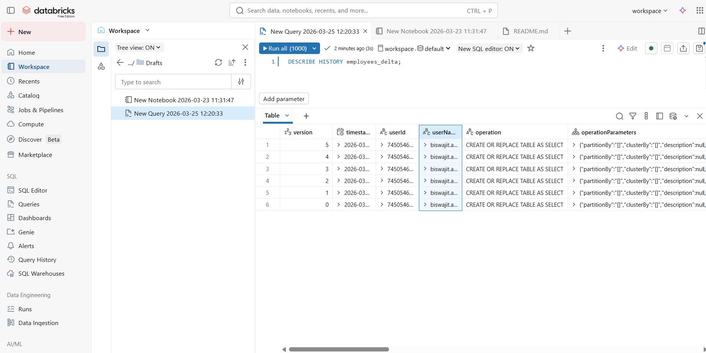

# 📘 Day 6 – Delta Lake Fundamentals

Delta Lake is an open-source storage layer that brings ACID transactions,
schema enforcement, and time travel to your data lake.

It is the foundation of the Lakehouse Architecture and widely used in
Azure Databricks & Apache Spark.

## 📌 What You Learned Today
### ✅ 1. Delta File Structure

A Delta table contains two key components:

```
📁 employees_delta/
 ├── part-0000.snappy.parquet
 ├── part-0001.snappy.parquet
 └── _delta_log/
      ├── 00000000000000000000.json
      ├── 00000000000000000001.json
      └── 00000000000000000002.json
```
Parquet files → actual data

_delta_log JSON files → metadata, schema, operations, versions

### ✅ 2. ACID Transactions

Delta Lake provides full ACID guarantees:

Feature	Description
- Atomicity	A write happens fully or not at all
- Consistency	Table always stays valid
- Isolation	Readers never see half-written data
- Durability	Once committed, the data stays safe

These properties make Delta Lake production-ready for batch and streaming pipelines.

### ✅ 3. Schema Enforcement

Delta Lake blocks bad/dirty data from entering your table.

Examples of violations:

- Wrong column datatype
- Missing required columns
- Extra unexpected columns
- Invalid schema evolution

👉 This makes your pipelines stable, consistent, and trustworthy.

### ✅ 4. Time Travel

Delta Lake maintains a full version history inside the _delta_log folder.

Use cases:

- Restore older versions
- Debug data issues
- Re-run ML models on historic data
- Perform audits & compliance checks

Examples :

- VERSION AS OF 0
- TIMESTAMP AS OF '2024-01-01'

### ✅ 5. MERGE (UPSERT) Operations

Delta MERGE allows:

- Insert new rows
- Update existing rows
- Deduplication
- Change Data Capture (CDC)

This is essential for incremental ETL pipelines.

## 🧪 Hands-On Performed (Using Databricks)

You performed:

✔ Created a Spark DataFrame

✔ Saved it as a Delta table

✔ Viewed metadata (DESCRIBE DETAIL)

✔ Viewed table history (DESCRIBE HISTORY)

✔ Explored the Delta transaction logs

✔ Observed table versioning

✔ Checked number of files & metadata

You also learned:
How Delta manages Parquet + logs
How Databricks shows table versions
How Delta auto-updates the commit history

## 🖼️ Delta Log Screenshot



## 📦Folder Structure for Day-06
```
📁 day-06-delta-lake/
│
├── delta-lake-basics.md
├── delta-table-history.png
├── delta-log-example.png
├── Screenshot-Databricks.jpeg
└── notes/
```

## 🏁 Summary

By completing Day 6, you now understand:

✔ How Delta Lake stores and manages data
✔ ACID transactions
✔ Schema enforcement & evolution
✔ Time Travel & versioning
✔ Incremental ETL with MERGE
✔ How Databricks shows Delta logs & metadata

These are core skills for Azure Data Engineers working with:

Azure Databricks
Delta Lake
Lakehouse Architecture
Enterprise ETL pipelines
